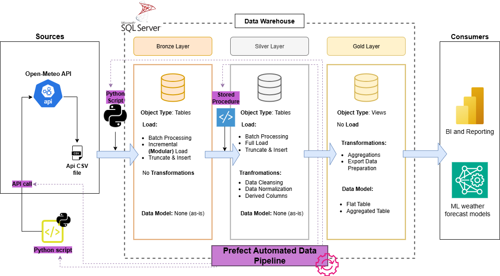
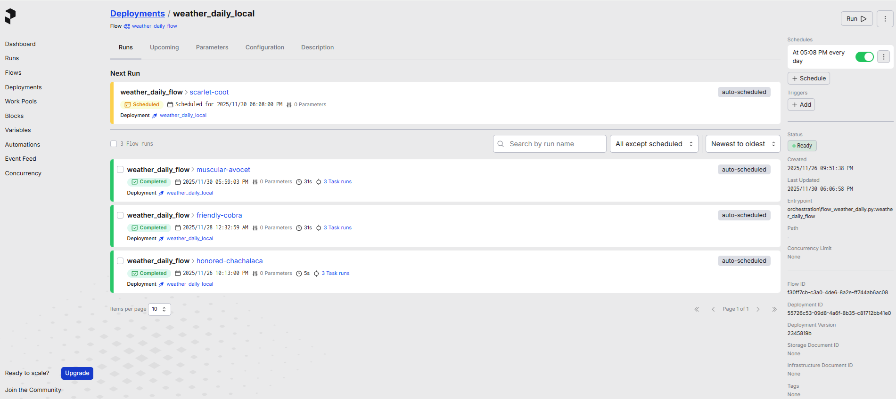
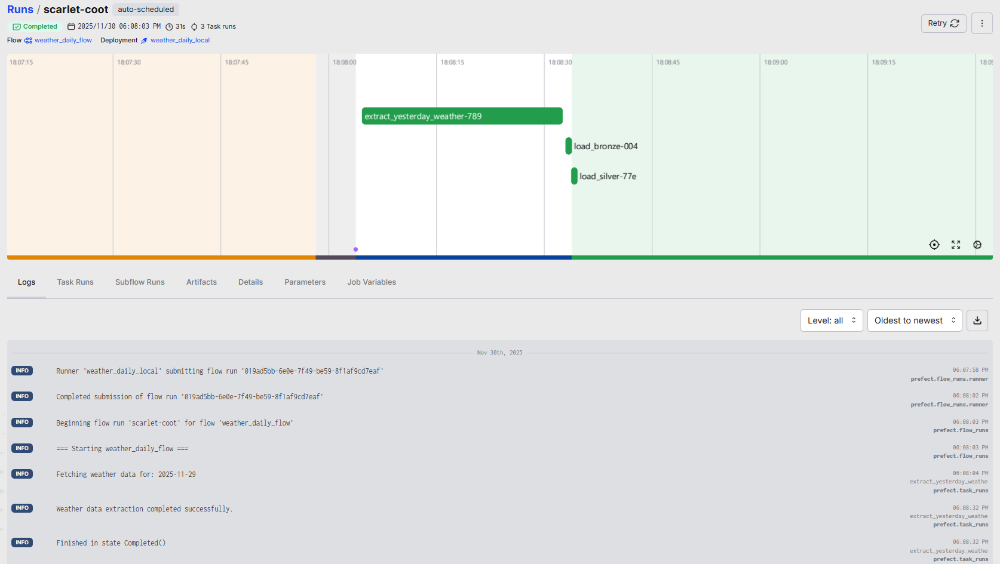

# 🌤️ Weather Data Pipeline (SQL Server + Prefect ETL Orchiestration tool)

## 1. Project Description

This project implements an end-to-end **data pipeline automated with an orchestration tool** that collects hourly weather measurements from the **Open-Meteo API**, processes them through a layered data architecture, and stores them in a SQL Server database. The workflow is fully orchestrated using **Prefect**, enabling daily automation without manual involvement.

The pipeline performs the following steps:

* Fetches weather data from the API and saves it as timestamped CSV files.
* Loads the raw CSVs into the **Bronze layer** using SQL Server BULK INSERT.
* Transforms and cleans the data in the **Silver layer** through a SQL stored procedure.
* Exposes analytics-ready **Gold views** for reporting and visualization.

This project demonstrates key Data Engineering concepts such as API ingestion, layered data modeling (Bronze/Silver/Gold), SQL transformations, workflow orchestration, and automated scheduling.


## 2. Technological Stack

This project is built using the following technologies:

* **Python 3.12** – main programming language for extraction and orchestration scripts.
* **Pandas** – processing API responses and generating CSV files.
* **Microsoft SQL Server** – database engine used for Bronze, Silver, and Gold layers.
* **T-SQL** – stored procedures, transformations, and view definitions.
* **PyODBC / PypyODBC** – database connectors for loading data into SQL Server.
* **Prefect 3** – workflow orchestration, scheduling, and automation.
* **Requests from Open-Meteo API** – weather data source.
* **Virtual Environment (`weather_env`)** – all dependencies installed and isolated inside the project environment.

This stack provides a clean, modular, and production-like setup suitable for automated daily ETL/ELT pipelines.

## 3. Data Architecture & Pipeline Flow

<div style="color:#ff9124; text-align:center;">

  <p>
    This project shows a classical Data Warehouse implemented according to the principles 
    of the Medallion architecture.
  </p>

  <p>
    Every day at 20:00 (Europe/Warsaw) the Prefect scheduler triggers the 
    <code>weather_daily_flow</code> pipeline. The workflow consists of the following stages:
  </p>

</div>



#### 1. API Extraction (Previous Day’s Weather Data)

A Python script sends a request to the Open-Meteo API for all configured U.S. state capitals.
The API returns hourly observations for the previous calendar day.
The data is saved locally as a timestamped CSV file inside the data/ directory.

#### 2. Bronze Layer Loading (One File at a Time)

A separate Python ingestion script iterates through all CSV files in the data/ folder.
Each file is inserted into the Bronze table using SQL Server BULK INSERT.
CSVs are processed independently, meaning:  
**if a single file fails to load, only that file is rolled back,
all other valid files are still loaded successfully**.    
This ensures a modular, fault-tolerant ingestion process.

#### 3. Silver Layer Transformation (Stored Procedure)

After the Bronze load completes, Prefect executes a SQL stored procedure (silver.load_silver).
The procedure cleans and transforms the Bronze data:
converts timestamp strings,
extracts the date and hour components,
standardizes city/state fields,
applies indexing for performance.
The transformed output is inserted into the Silver table.

#### 4. Gold Layer (Views for Analytics)

The Gold layer is implemented as SQL views created once during setup.
These views include daily aggregations and the most recent forecast snapshots.
Because they depend directly on Silver, they always remain up-to-date after each pipeline run.
This architecture cleanly separates raw, processed, and analytical data while enabling a fully automated daily refresh powered by Prefect.

## 4. Pipeline Monitoring with Prefect Web UI

Prefect provides a powerful and user-friendly web interface that allows you to monitor, inspect, and debug your data pipelines in real time.  
Below are examples from the monitoring dashboard used in this project.

---

### **Deployment schedule overview**

This screen shows the active deployment (`weather_daily_local`) together with its schedule, next run time, and historical runs.

It confirms that the pipeline is configured to run automatically every day at **20:00 (Europe/Warsaw)**.  (on the screen different hours, because of testing but in code uploaded code scheduled for 8pm CET (Polish time)).
You can also manually trigger runs, disable schedules, or inspect deployment metadata.



---

### **Detailed pipeline run report**

Here you can see a full execution timeline of a single pipeline run — including all task executions such as:

- `extract_yesterday_weather`  
- `load_bronze`  
- `load_silver`  

The graph shows precise timestamps, duration of each task, dependencies, and colored status indicators (green = success).  
Below the timeline you can access structured logs, parameters, and artifacts generated during the run.

This interface makes troubleshooting much easier and provides full observability over the orchestration layer.



---

Together, these Prefect dashboards make it simple to validate whether the pipeline executed correctly, audit historical runs, monitor scheduling, and quickly diagnose issues — turning this project into a fully observable and maintainable data workflow.

## 5. Virtual environment setup:


This project uses a dedicated Python virtual environment to isolate all dependencies listed in the `requirements.txt` file.  
The **same environment (`weather_env`) is used in both terminals** —  
for running the Prefect server (Terminal 1) and the deployment workflow (Terminal 2).


Open PowerShell, navigate to the project directory, and run:

```powershell
python -m venv weather_env 
.\weather_env\Scripts\Activate.ps1
pip install -r requirements.txt
```

## 6. SQL Server Setup & Project initialization:

Before running the pipeline, follow these steps to correctly configure the SQL Server environment and project structure.

---

1️⃣ Clone the repository

Choose any folder on your machine and clone the project:

```powershell
cd C:\YOUR\CHOSEN\DIRECTORY
git clone https://github.com/ppaczek04/weather_data_pipeline.git
cd weather_data_pipeline
```
2️⃣ Initialize the SQL database

Open SQL Server Management Studio (SSMS), connect to your local SQL Server instance, and execute:
```
init_database.sql
```

3️⃣ Create all table structures (DDL scripts)

Still in SSMS, run the following scripts in the correct order:
```
ddl_bronze.sql 
ddl_silver.sql 
proc_load_siler.sql
ddl_gold.sql 
```
This code will:  
- create the Bronze table  
- create the Silver table
- create s silver schema later used in pipeline
- create the Bronze views 

4️⃣ Update SQL connection settings in Python scripts

You must customize the SQL Server name to match your local machine.

**In script_load_bronze.py:**
```
SERVER_NAME = r"YOUR_MACHINE_NAME\SQLEXPRESS"
DATABASE_NAME = "Weather_DB"
TARGET_TABLE = "bronze.weather_api_data"
```

**In flow_weather_daily.py:**
```
SERVER_NAME = r"YOUR_MACHINE_NAME\SQLEXPRESS"
DATABASE_NAME = "Weather_DB"
```

**To find your actual SQL Server name, run this in SSMS:**
```
SELECT @@SERVERNAME;
```

## 7. How to Run a Pipeline

This project uses a locally hosted Prefect server to orchestrate and schedule the daily weather ETL pipeline.  
To fully run the system, you need **two terminals**.

---

### **🟩 Terminal 1 — Prefect Server (must stay ON 24/7)**

This terminal runs the Prefect orchestration backend.  
It **must remain open** so that Prefect can:

- execute the daily scheduled run (every day at 20:00),
- store pipeline history, logs, and statuses,
- serve the Prefect Web UI at http://127.0.0.1:4200.

```powershell
cd C:\PATH_TO_THE_PROJECT_REPO
.\weather_env\Scripts\Activate.ps1
prefect server start
```
⚡ If you wanted to avoid keeping your PC on 24/7, Prefect Server can be hosted in the cloud (e.g., on a VPS). But in this project we run it locally.

### **🟧 Terminal 2 — Pipeline Deployment Receiver**

This terminal is used to register the Prefect deployment.
Prefect keeps the deployment registered and scheduled and this terminal creates a 'Worker'
that listens to the pipeline when the scheduled time comes.

```powershell
cd C:\PATH_TO_THE_PROJECT_REPO
.\weather_env\Scripts\Activate.ps1
python orchestration\flow_weather_daily.py
```

After running this command once:
- the deployment is created,
- Prefect begins scheduling it daily at 20:00,
- you can close this second terminal.

## 8. Future improvements:
^^we could include creation of gold layer views in automation script  
^^we could create a Power BI live dashboard depicting our data on map


##  About me:
Hi! I am an aspiring data engineer student and I hope you found value in my project.The main point of creating it was that I wanted to teach myself usage of orchestration tool to finally be able to bring my data piplines to life! Free of use, prefect tool, seemed the best choice to support me in making my first step in ETL Pipeline Automation journey! Thank You for Your time and wish you all best!

